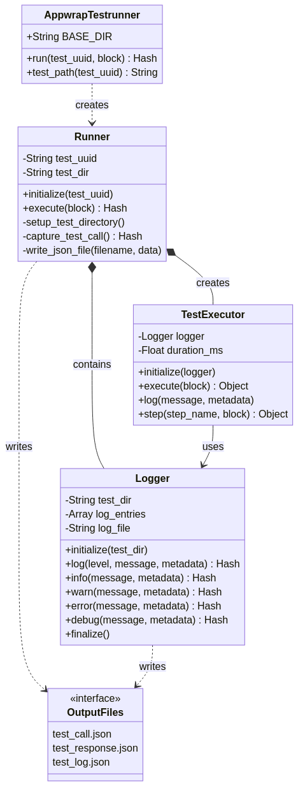

# Appwrap Testrunner - Project Summary

## Original Requirements

The **appwrap_testrunner** Ruby gem was specified with the following requirements:

### Core Functionality
- A Ruby gem designed for test execution and logging
- Writes exclusively to the `appwrap/testrun` folder
- Executes a single test via the rake task: `rake appwrap:testrunner:run test_uuid`

### Output Structure
When a test is executed, it creates a UUID-based folder at `appwrap/testrun/A_UUID/` containing three JSON files:
- **test_call.json** - captures the test invocation details
- **test_response.json** - captures the test response/results
- **test_log.json** - captures execution logs

## Implementation Overview

The gem has been implemented with a clean, modular architecture consisting of four main components:

### 1. Main Module (`Appwrap::Testrunner`)
The entry point that provides a simple API for running tests. It exposes two primary methods:
- `run(test_uuid, &block)` - executes a test with the given UUID
- `test_path(test_uuid)` - returns the path to a test run directory

### 2. Runner Class
Manages the complete test execution lifecycle. The Runner class is responsible for:
- Creating isolated test directories based on UUID
- Capturing test call metadata (timestamp, Ruby version, environment)
- Coordinating the Logger and TestExecutor
- Writing all three JSON output files
- Handling errors and ensuring proper cleanup

### 3. Logger Class
Provides structured logging capabilities with multiple log levels (info, warn, error, debug). Each log entry includes:
- ISO 8601 timestamp
- Log level
- Message content
- Optional metadata hash

The Logger accumulates entries during test execution and writes them to `test_log.json` upon finalization.

### 4. TestExecutor Class
Executes the actual test code and provides helper methods for test authors:
- Measures execution duration in milliseconds
- Provides `log()` method for custom logging
- Provides `step()` method for breaking tests into named, timed steps
- Each step is automatically logged with start, completion, and duration

## Architecture

The following diagram illustrates the relationships between components:



## Key Features Implemented

### Isolated Test Runs
Each test execution creates a unique directory under `appwrap/testrun/{UUID}/`, ensuring complete isolation between test runs.

### Structured JSON Output
All output files use pretty-printed JSON for easy readability and parsing. The structure is consistent and well-documented.

### Error Handling
The gem gracefully handles test failures, capturing full error details including:
- Error message
- Error class name
- Stack trace (first 10 lines)

### Rake Tasks
Three rake tasks are provided:
- `rake appwrap:testrunner:run[test_uuid]` - run a test
- `rake appwrap:testrunner:list` - list all test runs
- `rake appwrap:testrunner:clean` - clean all test run directories

### Step-Based Execution
Tests can be organized into named steps, each with individual timing and logging:

```ruby
Appwrap::Testrunner.run(test_uuid) do |executor|
  executor.step("Initialize") do
    # setup code
  end
  
  executor.step("Execute") do
    # test logic
  end
  
  executor.step("Cleanup") do
    # cleanup code
  end
end
```

## Testing

The gem includes comprehensive test coverage using both RSpec and Cucumber:

### RSpec Tests
- **appwrap_testrunner_spec.rb** - Integration tests for the main module
- **runner_spec.rb** - Unit tests for the Runner class
- **logger_spec.rb** - Unit tests for the Logger class
- **test_executor_spec.rb** - Unit tests for the TestExecutor class

### Cucumber Features
- **test_execution.feature** - End-to-end scenarios covering:
  - Successful test execution
  - Failed test execution
  - JSON file structure validation
  - Log entry verification

## File Structure

```
appwrap_testrunner/
├── lib/
│   └── appwrap/
│       └── testrunner/
│           ├── version.rb
│           ├── runner.rb
│           ├── logger.rb
│           └── test_executor.rb
│       └── testrunner.rb
├── spec/
│   ├── spec_helper.rb
│   ├── appwrap_testrunner_spec.rb
│   ├── runner_spec.rb
│   ├── logger_spec.rb
│   └── test_executor_spec.rb
├── features/
│   ├── support/
│   │   └── env.rb
│   ├── step_definitions/
│   │   └── testrunner_steps.rb
│   └── test_execution.feature
├── docs/
│   ├── architecture.mmd
│   ├── architecture.png
│   └── project_summary.md
├── appwrap_testrunner.gemspec
├── Gemfile
├── Rakefile
├── README.md
├── CHANGELOG.md
├── LICENSE.txt
└── .gitignore
```

## Usage Example

```ruby
require 'appwrap/testrunner'

test_uuid = "my-test-#{SecureRandom.uuid}"

result = Appwrap::Testrunner.run(test_uuid) do |executor|
  executor.log("Starting test execution")
  
  executor.step("Setup environment") do
    # initialization code
    { initialized: true }
  end
  
  executor.step("Run main test") do
    # test logic
    { result: "success", value: 42 }
  end
  
  executor.log("Test completed successfully")
  { success: true }
end

puts "Status: #{result[:status]}"
puts "Output: #{Appwrap::Testrunner.test_path(test_uuid)}"
```

## Output Files Example

### test_call.json
```json
{
  "test_uuid": "my-test-uuid",
  "called_at": "2025-10-20T12:00:00Z",
  "ruby_version": "3.3.6",
  "gem_version": "0.1.0",
  "working_directory": "/path/to/project",
  "environment": {
    "rails_env": "test",
    "rack_env": null
  }
}
```

### test_response.json
```json
{
  "test_uuid": "my-test-uuid",
  "status": "success",
  "result": {
    "success": true
  },
  "executed_at": "2025-10-20T12:00:01Z",
  "duration_ms": 123.45
}
```

### test_log.json
```json
{
  "total_entries": 7,
  "entries": [
    {
      "timestamp": "2025-10-20T12:00:00Z",
      "level": "info",
      "message": "Starting test execution",
      "metadata": {
        "test_uuid": "my-test-uuid"
      }
    },
    {
      "timestamp": "2025-10-20T12:00:00Z",
      "level": "debug",
      "message": "Executing test block",
      "metadata": {}
    },
    {
      "timestamp": "2025-10-20T12:00:00Z",
      "level": "info",
      "message": "Starting test execution",
      "metadata": {}
    },
    {
      "timestamp": "2025-10-20T12:00:00Z",
      "level": "info",
      "message": "Starting step: Setup environment",
      "metadata": {}
    },
    {
      "timestamp": "2025-10-20T12:00:00Z",
      "level": "info",
      "message": "Completed step: Setup environment",
      "metadata": {
        "duration_ms": 12.34
      }
    },
    {
      "timestamp": "2025-10-20T12:00:01Z",
      "level": "info",
      "message": "Test completed successfully",
      "metadata": {}
    },
    {
      "timestamp": "2025-10-20T12:00:01Z",
      "level": "info",
      "message": "Test execution completed successfully",
      "metadata": {
        "duration_ms": 123.45
      }
    }
  ]
}
```

## Technical Requirements

- **Ruby Version**: >= 3.3.6
- **Dependencies**: 
  - Development: rake, rspec, cucumber, json-schema
  - Runtime: None (uses only Ruby standard library)

## License

MIT License - See LICENSE.txt for details

## Version

Current version: 0.1.0 (Initial release)

---

**Generated**: October 20, 2025

